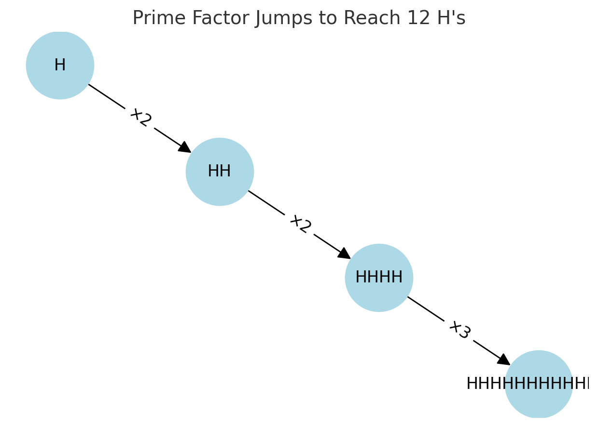

# Minimum Operations to Get `n` H's

This function finds the most efficient way to reach exactly `n` H’s using only two actions:

- **Copy All** – copy all the H’s on screen  
- **Paste** – paste the copied H’s

The trick is to break `n` into its **prime factors**.  
Each factor represents one “Copy All” followed by the needed number of “Paste” actions, giving the shortest possible sequence of steps.

---

## Example

For `n = 12`, the prime factors are `2 × 2 × 3`.  
Following these factors step by step reaches 12 H’s in the minimum number of operations.

---

